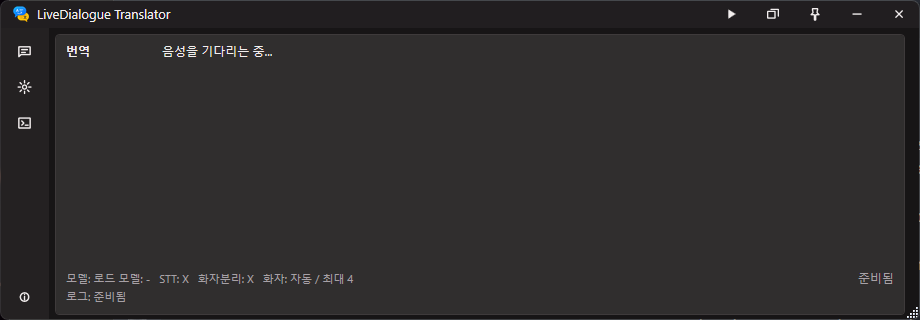
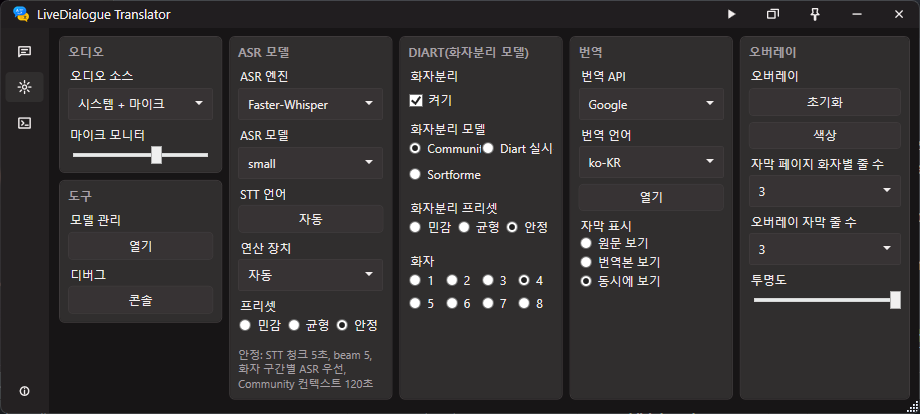
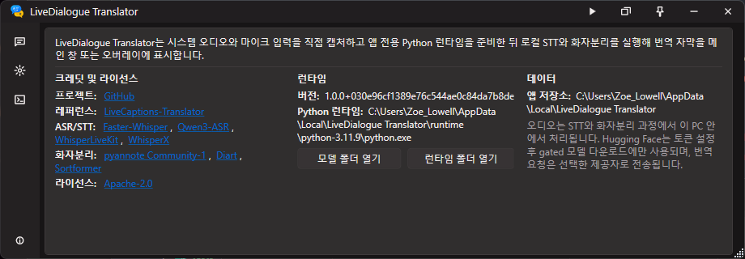
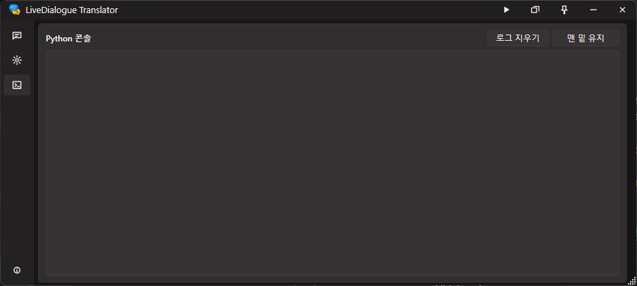

# LiveDialogue-Translator

LiveDialogue Translator is a local-first Windows desktop captioning app. It captures
system audio and microphone audio directly, runs local speech-to-text, assigns
speaker labels with local diarization, and can show translated captions in the
main window or a transparent overlay.

The project is inspired by
[LiveCaptions-Translator](https://github.com/SakiRinn/LiveCaptions-Translator),
but it does not depend on Windows Live Captions. Audio is processed through the
app's own capture pipeline and Python worker.

## Screenshots

Screenshot assets are managed under `docs/assets/screenshots`. Additional notes
and the overlay placeholder are kept in [docs/screenshots.md](docs/screenshots.md).

### Caption Workspace



The caption workspace is the default screen. It keeps live speaker captions,
translation output, model status, and capture state visible in a compact window.

### Settings



The settings screen separates audio input, ASR model, diarization, translation,
overlay, model management, and debug controls into compact groups.

### Info



The info screen lists the project links, reference project, supported ASR/STT
and diarization backends, license, runtime path, and local data directory.

### Python Console



The console screen shows Python worker logs separately from captions, with quick
controls for clearing logs and keeping the view pinned to the latest output.

### Overlay

> Overlay screenshot placeholder. Add the final overlay capture to
> `docs/assets/screenshots/overlay.png` and replace this block when the overlay
> image is ready.

## Current Scope

- Capture system audio, microphone audio, or a mixed device.
- Normalize captured audio to 16 kHz mono PCM before worker processing.
- Run a newline-delimited JSON protocol between the WPF app and Python worker.
- Run local ASR/STT with `faster-whisper`, `Qwen3-ASR`, `WhisperLiveKit`, or
  `WhisperX`. `faster-whisper` is the default engine.
- Install optional ASR engines into isolated package folders so engine-specific
  dependencies do not overwrite the base runtime.
- Run local speaker diarization with `pyannote.audio==4.0.4` and
  `pyannote/speaker-diarization-community-1`, `Diart`, or `Sortformer`.
- Translate captions with the no-key Google provider. Other providers are
  currently shown as placeholders.
- Show captions in a compact WPF shell and in a configurable transparent
  overlay.
- Store app settings and downloaded runtime/model files under LocalAppData.
- Follow the Windows UI language at startup. Korean and English strings are
  included.

## Requirements

- Windows desktop environment.
- .NET 8 SDK for development builds.
- Internet access on first setup so the app can download the managed Python
  runtime, Python packages, and selected model files.
- Hugging Face access is required only when local pyannote diarization is used.
  Accept the selected model terms and provide a fine-grained token with
  `User permissions > Repositories > Read access to contents of all public gated
  repos you can access`.
- NVIDIA CUDA is optional. The app can install CUDA-enabled PyTorch when an
  NVIDIA GPU is detected.
- Overlapping-speech separation is optional and is enabled only when the app
  detects a supported NVIDIA GPU and enough system and video memory.

End users do not need to install Python manually. On first Start or Prepare, the
app downloads the official Python 3.11.9 x64 embeddable runtime from python.org,
extracts it under `%LOCALAPPDATA%\LiveDialogue Translator\runtime\python-3.11.9`,
bootstraps pip, and installs the worker dependencies there.

> [!WARNING]
> Local runtime and model downloads can use substantial disk space. One fully
> provisioned setup occupied approximately **23 GB** under
> `%LOCALAPPDATA%\LiveDialogue Translator` (about 14.6 GB of models and 8.4 GB
> of runtime files). The actual size varies with the ASR/diarization engines and
> models you install; keep the free-space guidance below in mind before setup.

## Model Combination Hardware Guide

The numbers below are conservative minimums for the current selectable model
families in this app. They are intended for short live captures and model
loading without out-of-memory failures. Real-time stability improves
significantly with the recommended CUDA path and lower preset/model choices.
They are app-level planning baselines, not official vendor guarantees.

Important assumptions:

- CPU mode means `Compute = CPU`. It is practical for light Whisper models, but
  large Whisper, Qwen3-ASR, WhisperX, and Sortformer can fall behind real time.
- CUDA mode means an NVIDIA GPU with current drivers and enough free VRAM. Avoid
  running another heavy CUDA workload at the same time.
- Qwen3-ASR uses the Qwen3 forced aligner by default, so the 0.6B aligner must
  also fit in memory.
- `Diart` uses CPU by default when `Compute = Auto`; choose `Compute = CUDA` if
  you want Diart to run on the GPU.
- `Sortformer` uses the WhisperLiveKit Sortformer package even when the selected
  ASR engine is not WhisperLiveKit.
- Keep at least 30 GB free disk for one heavy setup and 50-80 GB if you install
  every optional ASR engine and model cache.

### Two-speaker overlap separation

The `Overlapping Speech` setting detects the CPU, logical processor count,
system memory, NVIDIA GPU, and VRAM. `Auto recommendation` only lists models
that satisfy the app's conservative memory policy. Unsupported selections are
reset to Auto, and no separation package or checkpoint is installed when the
machine cannot support the five-second target.

| Model | App minimum | Streaming design | Multilingual flow | Selection status |
| --- | --- | --- | --- | --- |
| MossFormer2_SS_16K | NVIDIA CUDA, 10 GB VRAM, 16 GB RAM | 2-second windows with 250 ms continuity overlap | Language-independent waveform separation, then the selected multilingual ASR and translation provider | Preferred on higher-memory GPUs |
| SepFormer WHAMR16k | NVIDIA CUDA, 6 GB VRAM, 16 GB RAM | 2-second windows with 250 ms continuity overlap | Language-independent waveform separation, then the selected multilingual ASR and translation provider | Lower-memory fallback |

Both integrated models produce two 16 kHz speaker streams. Channel order is
stabilized across windows before each stream is transcribed. When only one
credible stem is present, the worker avoids duplicate captions. Separation is
applied to system audio and replaces acoustic diarization for that capture;
microphone input keeps its dedicated microphone label. WhisperLiveKit is not
offered with separation because its stateful streaming ASR session cannot
safely consume two independent streams. WhisperX is also excluded because its
isolated PyTorch 2.8 runtime cannot be mixed with the PyTorch 2.11 separation
runtime.

RE-SepFormer, SkiM, SepReformer, SR-CorrNet, and TF-GridNet are intentionally
not exposed. The current app does not have a reproducible Windows Python 3.11,
16 kHz checkpoint and maintained inference package path for those candidates.
The five-second figure is an end-to-end design target, not a guarantee: actual
latency still depends on the ASR model, translation provider, GPU load, and
network response time.

### ASR-only minimums

Use this table when speaker diarization is disabled.

| ASR engine / model | CPU minimum | CUDA minimum | Notes |
| --- | --- | --- | --- |
| Faster-Whisper `tiny`, `base`, `small` | 4 CPU cores, 8 GB RAM | 4 GB VRAM, 8 GB RAM | Best CPU-compatible path. |
| Faster-Whisper `medium`, `large-v3`, `large-v3-turbo` | 8 CPU cores, 16 GB RAM | 8 GB VRAM, 16 GB RAM | CPU works, but large models may not keep up in live use. |
| Qwen3-ASR `0.6B` + forced aligner | 8 CPU cores, 32 GB RAM | 8 GB VRAM, 24 GB RAM | CPU is mainly for testing; CUDA is strongly preferred. |
| Qwen3-ASR `1.7B` + forced aligner | 12 CPU cores, 48 GB RAM | 12 GB VRAM, 32 GB RAM | Default Qwen model; use CUDA for realistic latency. |
| WhisperLiveKit default (`large-v3-turbo`) | 8 CPU cores, 24 GB RAM | 8 GB VRAM, 16 GB RAM | Streaming stack; CUDA recommended. |
| WhisperX `tiny`, `base`, `small` | 8 CPU cores, 16 GB RAM | 6 GB VRAM, 16 GB RAM | Alignment adds memory and startup cost over faster-whisper. |
| WhisperX `medium`, `large-v3`, `large-v3-turbo` | 12 CPU cores, 32 GB RAM | 10 GB VRAM, 24 GB RAM | Lower batch/model size if CUDA memory is tight. |

### ASR + speaker diarization minimums

Use this table when speaker diarization is enabled. `Community-1` and `Diart`
require accepted Hugging Face model terms and a valid token. `Sortformer` does
not require pyannote model access, but it is the most CUDA-oriented diarization
path.

| ASR engine / model | Diarization model | CPU minimum | CUDA minimum | Notes |
| --- | --- | --- | --- | --- |
| Faster-Whisper `tiny/base/small` | Community-1 | 4 CPU cores, 16 GB RAM | 6 GB VRAM, 16 GB RAM | Lowest balanced setup with speaker labels. |
| Faster-Whisper `tiny/base/small` | Diart | 4 CPU cores, 16 GB RAM | 6 GB VRAM, 16 GB RAM | Good low-latency choice; Auto keeps Diart on CPU. |
| Faster-Whisper `tiny/base/small` | Sortformer | 8 CPU cores, 16 GB RAM | 8 GB VRAM, 16 GB RAM | CPU is usable only for light testing. |
| Faster-Whisper `medium/large-v3/large-v3-turbo` | Community-1 | 8 CPU cores, 32 GB RAM | 8 GB VRAM, 24 GB RAM | CUDA recommended for live captions. |
| Faster-Whisper `medium/large-v3/large-v3-turbo` | Diart | 8 CPU cores, 32 GB RAM | 8 GB VRAM, 24 GB RAM | Stable if ASR model fits comfortably. |
| Faster-Whisper `medium/large-v3/large-v3-turbo` | Sortformer | 12 CPU cores, 32 GB RAM | 10 GB VRAM, 24 GB RAM | Prefer 12 GB+ VRAM for `large-v3`. |
| Qwen3-ASR `0.6B` + forced aligner | Community-1 | 8 CPU cores, 32 GB RAM | 8 GB VRAM, 24 GB RAM | CPU latency is high; use smaller chunks/presets if needed. |
| Qwen3-ASR `0.6B` + forced aligner | Diart | 8 CPU cores, 32 GB RAM | 8 GB VRAM, 24 GB RAM | CUDA leaves more CPU headroom for capture and translation. |
| Qwen3-ASR `0.6B` + forced aligner | Sortformer | 12 CPU cores, 32 GB RAM | 10 GB VRAM, 24 GB RAM | Runs two heavy neural stacks; CUDA strongly preferred. |
| Qwen3-ASR `1.7B` + forced aligner | Community-1 | 12 CPU cores, 48 GB RAM | 12 GB VRAM, 32 GB RAM | Practical minimum for the default Qwen setup. |
| Qwen3-ASR `1.7B` + forced aligner | Diart | 12 CPU cores, 48 GB RAM | 12 GB VRAM, 32 GB RAM | Use CUDA and close other GPU workloads. |
| Qwen3-ASR `1.7B` + forced aligner | Sortformer | 16 CPU cores, 64 GB RAM | 12 GB VRAM, 32 GB RAM | 16 GB VRAM is more comfortable for long sessions. |
| WhisperLiveKit default (`large-v3-turbo`) | Community-1 | 12 CPU cores, 32 GB RAM | 10 GB VRAM, 24 GB RAM | WhisperLiveKit handles ASR; pyannote handles diarization. |
| WhisperLiveKit default (`large-v3-turbo`) | Diart | 12 CPU cores, 32 GB RAM | 10 GB VRAM, 24 GB RAM | Use CUDA if Diart should not consume CPU headroom. |
| WhisperLiveKit default (`large-v3-turbo`) | Sortformer | 12 CPU cores, 32 GB RAM | 10 GB VRAM, 24 GB RAM | Native WhisperLiveKit + Sortformer streaming path. |
| WhisperX `tiny/base/small` | Community-1 | 8 CPU cores, 16 GB RAM | 8 GB VRAM, 16 GB RAM | Word alignment and diarization both add overhead. |
| WhisperX `tiny/base/small` | Diart | 8 CPU cores, 16 GB RAM | 8 GB VRAM, 16 GB RAM | Good if word timestamps matter more than lowest latency. |
| WhisperX `medium/large-v3/large-v3-turbo` | Community-1 | 12 CPU cores, 32 GB RAM | 12 GB VRAM, 32 GB RAM | Reduce WhisperX batch size if memory is tight. |
| WhisperX `medium/large-v3/large-v3-turbo` | Diart | 12 CPU cores, 32 GB RAM | 12 GB VRAM, 32 GB RAM | Heavy but reasonable on 12 GB+ NVIDIA GPUs. |

WhisperX with Sortformer is intentionally disabled. Their isolated PyTorch and
Lightning stacks conflict at runtime, so the settings page automatically uses
Community-1 instead. WhisperLiveKit with overlap separation and WhisperX with
either overlap separation model are also disabled.

For a general-purpose Windows desktop setup using CUDA, the practical baseline
is a modern 8-core CPU, 32 GB system RAM, and an NVIDIA GPU with 12 GB VRAM.
That class of machine can cover every selectable combination, although
Qwen3-ASR `1.7B` plus Sortformer benefits from 16 GB VRAM.

### Reproducible Python runtimes

Every supported backend has exact top-level and compatibility-critical package
versions. `worker/package-lock.json` is checked before model loading, including
the CUDA build suffix for WhisperX. A missing or mismatched package makes the
app rebuild that isolated runtime in a staging directory, validate it, and then
replace the previous runtime. This prevents a partial install or a later pip
resolver change from silently mixing Qwen3-ASR, WhisperLiveKit, WhisperX, or
overlap-separation dependencies.

## Quick Start

1. Build or package the app with the commands below.
2. Launch `LiveDialogueTranslator.exe`.
3. Open Model Manager if the app asks for Hugging Face access.
4. Choose the ASR model, diarization mode, input source, and translation target.
5. Press Start capture.

The first run can take several minutes because the app prepares Python packages
and model files. Later runs reuse the LocalAppData runtime and cache.

## Build and Package

This repository can use a repo-local SDK at `.dotnet-sdk\dotnet.exe` or a system
`dotnet` SDK.

```powershell
.\.dotnet-sdk\dotnet.exe run --project tests\LiveDialogueTranslator.Tests\LiveDialogueTranslator.Tests.csproj
.\.dotnet-sdk\dotnet.exe build src\LiveDialogueTranslator.App\LiveDialogueTranslator.App.csproj -c Release
.\scripts\package.ps1
```

`scripts\package.ps1` publishes to `publish\win-x64`. If Inno Setup is
installed, it also creates `artifacts\installer\LiveDialogueTranslatorSetup-x64.exe`.

## Manual Worker Testing

For developer-only worker testing, use the app-managed runtime after it has been
prepared:

```powershell
%LOCALAPPDATA%\LiveDialogue Translator\runtime\python-3.11.9\python.exe -m pip install --no-warn-script-location -r worker\requirements.txt
%LOCALAPPDATA%\LiveDialogue Translator\runtime\python-3.11.9\python.exe worker\speaker_worker.py
```

The worker reads JSON commands from stdin and writes JSON events to stdout. Use
the WPF app for normal operation because it owns audio capture, model setup,
translation, and worker lifecycle management.

## Repository Layout

- `src\LiveDialogueTranslator.App` - WPF desktop app, overlay window, settings, and
  worker orchestration.
- `src\LiveDialogueTranslator.Core` - shared protocol, startup planning, transcript,
  speaker, runtime, and history logic.
- `worker` - Python speech worker, package requirements, and engine environment
  presets.
- `tests\LiveDialogueTranslator.Tests` - lightweight executable tests.
- `scripts` - packaging helpers.
- `installer` - Inno Setup installer definition.

## Privacy

Audio is processed locally by the Python worker. Hugging Face is contacted only
to download gated model files after you provide a token. Translation requests are
sent to the selected translation provider.

## Credits

- [LiveCaptions-Translator](https://github.com/SakiRinn/LiveCaptions-Translator)
  for the original real-time caption translation reference.
- [faster-whisper](https://github.com/SYSTRAN/faster-whisper) for local Whisper
  inference.
- [Qwen3-ASR](https://huggingface.co/Qwen/Qwen3-ASR-1.7B) for Qwen ASR model
  support.
- [WhisperLiveKit](https://github.com/QuentinFuxa/WhisperLiveKit) for
  streaming Whisper + Sortformer support.
- [WhisperX](https://github.com/m-bain/whisperX) for WhisperX ASR support.
- [pyannote.audio](https://github.com/pyannote/pyannote-audio) for Community-1
  speaker diarization.
- [Diart](https://github.com/juanmc2005/diart) for realtime diarization.
- [Sortformer](https://huggingface.co/nvidia/diar_streaming_sortformer_4spk-v2)
  for streaming diarization support.

## License

LiveDialogue Translator is licensed under the Apache License 2.0. See
[LICENSE](LICENSE).
