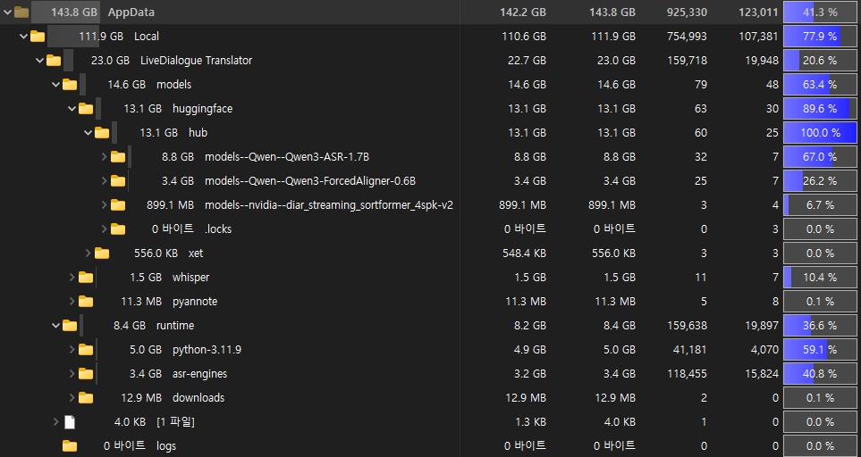

# Screenshots

Screenshot assets are stored in `docs/assets/screenshots` so README media stays
separate from source and build files.

## Caption Workspace

The caption workspace is the default screen. It keeps live speaker captions,
translation output, model status, and capture state visible in a compact window.

## Settings

The settings screen separates audio input, ASR model, diarization, translation,
overlay, model management, and debug controls into compact groups.

## Info

The info screen lists the project links, reference project, supported ASR/STT
and diarization backends, license, runtime path, and local data directory.

## Python Console

The console screen shows Python worker logs separately from captions, with quick
controls for clearing logs and keeping the view pinned to the latest output.

## Installed Size Example

One fully provisioned local setup used approximately 23 GB: about 14.6 GB for
downloaded models and 8.4 GB for runtime files. Actual disk use varies with the
selected ASR and diarization engines and models.

## Overlay

> Overlay screenshot placeholder. Add the final overlay capture to
> `docs/assets/screenshots/overlay.png` and replace this block when the overlay
> image is ready.
